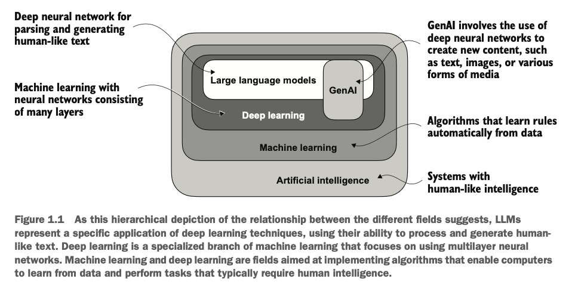

# Build-a-Large-Language-Model-From-Scratch---book-notes-and-experiments
The models you’ll create are smaller in scale compared to the large foundational models; they use the same concepts and serve as powerful educational tools to grasp the core mechanisms and techniques used in building state-of-the-art LLMs.

# Chapter 1: understanding the large language models

🎯Q. LLMs vs earlier NLP 

- An LLM is a specific type of model within the broader field of NLP.

- LLMs are transformer-based deep models trained on massive text corpora that deliver broad, context-aware language abilities far beyond earlier task-specific or rule-based NLP systems — though “understand” here means producing coherent, contextually relevant text, not human-level consciousness.

- Large language models (LLMs), built on deep neural networks and powered by the transformer architecture, represent a major shift in natural language processing (NLP). Unlike earlier NLP approaches, which relied on handcrafted rules or simpler models tailored to narrow tasks like spam detection or translation, LLMs are trained on vast amounts of text data.

- While earlier NLP models excelled at categorization and pattern recognition, they struggled with complex understanding and generation. LLMs, by contrast, demonstrate remarkable versatility, though their “understanding” refers to producing text that appears meaningful and relevant.
⭐This paradigm shift—driven by transformers and massive datasets—has fundamentally transformed NLP into a far more capable and flexible field.⭐

🎯Q. What is an LLM 

- An LLM is a neural network designed to understand, generate, and respond to human-like text.
- Models like this often have
tens or even hundreds of billions of parameters, which are the adjustable weights in
the network that are optimized during training to predict the next word in a sequence.
- The “large” in “large language model” refers to both the model’s size in terms of parameters and the immense dataset on which it’s trained.
- Think of `parameters` as the number of knobs you can turn to adjust the model's behavior, and training data is like the vast library of books and articles the model reads to learn language patterns. 

- LLMs utilize an architecture called the `transformer`, which allows them to pay selective attention to different parts of the input when making predictions, making them
especially adept at handling the nuances and complexities of human language.

- ⭐⭐Machine learning⭐ and ⭐deep learning⭐ are fields aimed at implementing algorithms that enable computers
to learn from data and perform tasks that typically require human intelligence.⭐

- traditional machine learning requires a manual feature engineering step, where domain experts identify and extract relevant features from the data to train models. In contrast, deep learning models automatically learn hierarchical feature representations from raw data through multiple deep layers, eliminating the need for manual feature engineering.

 
 
 
 
 
 
 
 
 
 
 
***********

Emojis used

⭐ - For important points
🔥 - For hot/important exam topics
💡 - For key concepts/tips
⚠️ - For warnings/common mistake
🎯 - For exam targets/focus areas/ question 
🚀 - For advanced topics .
🚫 - For indicating something that cannot be used or a concerning point

