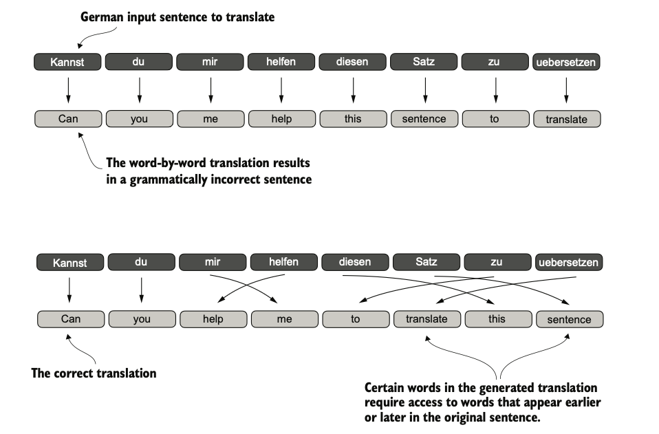

# Build-a-Large-Language-Model-From-Scratch---book-notes-and-experiments
The models you’ll create are smaller in scale compared to the large foundational models; they use the same concepts and serve as powerful educational tools to grasp the core mechanisms and techniques used in building state-of-the-art LLMs.

#### Majority of the content in this repo is from the book "Build a Large Language Model from Scratch" by Sebastian Raschka. All credits to the author for the amazing work. Some text is directly copied from the book for and some is tuned for my better understanding.

#### executing below steps in the book

# Chapter 1: understanding the large language models

🎯Q. LLMs vs earlier NLP 

- An LLM is a specific type of model within the broader field of NLP.

- LLMs are transformer-based deep models trained on massive text corpora that deliver broad, context-aware language abilities far beyond earlier task-specific or rule-based NLP systems — though “understand” here means producing coherent, contextually relevant text, not human-level consciousness.

- Large language models (LLMs), built on deep neural networks and powered by the transformer architecture, represent a major shift in natural language processing (NLP). Unlike earlier NLP approaches, which relied on handcrafted rules or simpler models tailored to narrow tasks like spam detection or translation, LLMs are trained on vast amounts of text data.

- While earlier NLP models excelled at categorization and pattern recognition, they struggled with complex understanding and generation. LLMs, by contrast, demonstrate remarkable versatility, though their “understanding” refers to producing text that appears meaningful and relevant.
⭐This paradigm shift—driven by transformers and massive datasets—has fundamentally transformed NLP into a far more capable and flexible field.⭐

🎯Q. What is an LLM 

- An LLM is a neural network designed to understand, generate, and respond to human-like text.
- Models like this often have tens or even hundreds of billions of parameters, which are the adjustable weights in the network that are optimized during training to predict the next word in a sequence.
- The “large” in “large language model” refers to both the model’s size in terms of parameters and the immense dataset on which it’s trained.
- Think of `parameters` as the number of knobs you can turn to adjust the model's behavior, and training data is like the vast library of books and articles the model reads to learn language patterns. 

- LLMs utilize an architecture called the `transformer`, which allows them to pay selective attention to different parts of the input when making predictions, making them
especially adept at handling the nuances and complexities of human language.

- ⭐⭐Machine learning⭐ and ⭐deep learning⭐ are fields aimed at implementing algorithms that enable computers
to learn from data and perform tasks that typically require human intelligence.⭐

- traditional machine learning requires a manual feature engineering step, where domain experts identify and extract relevant features from the data to train models. In contrast, deep learning models automatically learn hierarchical feature representations from raw data through multiple deep layers, eliminating the need for manual feature engineering.

🎯Q. Stages of buiding and using the LLMs 

- The general process of creating an LLM includes `pretraining` and `fine-tuning`.
- 🎯traditional machine learning vs pretraining and fine-tuning of LLMs🎯:
  - In traditional `machine learning`, it uses `supervised learning`, where models are trained from scratch on a single, specific task using labeled data.
  - In `pretraning` an LLM large `self-supervised` learning is used, where the model learns general language patterns from massive amounts of unlabeled text data. 
  - In `fine-tuning` the LLMs it uses the `supervised learning on smaller, labeled datasets to adapt the model for specific tasks`.

  - The two most popular categories of fine-tuning LLMs are `instruction fine-tuning` and `classification fine-tuning`.
    - In `instruction fine-tuning`, the labeled dataset consists of instruction and answer pairs, such as a query to translate a text accompanied by the correctly translated text. 
    - In `classification fine-tuning`, the labeled dataset consists of texts and associated class labels—for example, emails associated with “spam” or “not spam” labels.

🎯Q. Transformer architecture - key notes

- Most modern LLMs rely on the transformer architecture, which is a 💡`deep neural network architecture`💡 introduced in the 2017 paper “Attention Is All You Need”
- To understand LLMs, we must understand the original transformer, which was developed for machine translation, translating English texts to German and French.
- There are key two steps in the transformer architecture:
  1. The `encoder` processes the input text and creates a numerical representation of it (Embeddings) which capture the contextual information of the input.
  2. The `decoder` takes this representation initially convert literally word by word  and then goes through self-attention and then generates the final output text.
- This image is simple initial depiction however many things goes inside which autor is about to explain in the next chapters.

- After this paper on this concept other variants transformer emerged and become backbone of many LLMs. Like BERT (short for bidirectional
encoder representations from transformers) and the various GPT models (short for generative pretrained transformers)

🎯Q. A closer look at the GPT architecture

- GPT was originally introduced in the paper “Improving Language Understanding by Generative Pre-Training” in 2018 by Alec Radford and colleagues at OpenAI.
- The model is simply trained to preduct the next --> word in a sequence of words.
- Compared to the original transformer architecture we covered in section 1.4, the general GPT architecture is relatively simple. Essentially, it’s just the decoder part without the encoder.
- Since decoder-style models like GPT generate text by predicting text one word at a time, they are considered a type of `autoregressive model`.
- `Autoregressive models` incorporate their previous outputs as inputs for future predictions.
- The ability to perform tasks that the model wasn’t explicitly trained to perform is called an `emergent behavior`. This capability isn’t explicitly taught during training but emerges as a natural consequence of the model’s exposure to vast quantities of multilingual data in diverse contexts.

🎯Q. Building a large language model - stages (section 1.7)

- GPT was originally introduced in the paper “Improving Language Understanding by Generative Pre-Training” in 2018 by Alec Radford and colleagues at OpenAI.
- The model is simply trained to preduct the next --> word in a sequence of words.
- Compared to the original transformer architecture we covered in section 1.4, the general GPT architecture is relatively simple. Essentially, it’s just the decoder part without the encoder.
- Since decoder-style models like GPT generate text by predicting text one word at a time, they are considered a type of `autoregressive model`.
- `Autoregressive models` incorporate their previous outputs as inputs for future predictions.
- The ability to perform tasks that the model wasn’t explicitly trained to perform is called an `emergent behavior`. This capability isn’t explicitly taught during training but emerges as a natural consequence of the model’s exposure to vast quantities of multilingual data in diverse contexts.

- 

# Chapter 2: working with text data

🎯Q. understanding embeddings

- The concept of converting data into a vector format is often referred to as embedding.
- It’s important to note that different data formats require distinct embedding models. For example, an embedding model designed for text would not be suitable for embedding audio or video data.
- ⭐The primary purpose of embeddings is to convert nonnumeric data into a format that neural networks can process.⭐

🎯Q. Key steps in data preparation which includes embeddings - IMPORTANT

- All the steps along with test code is mentiond under @chp_02_embeddings/embeddings.ipynb file. Please have a look.
- Below is the summary of the steps.
  1. `Tokenization` - breaking down text into smaller units called tokens.
  2. `Token IDs` - converting tokens into numerical representations called token IDs.
  3. `Token Embeddings` - transforming token IDs into dense vectors using an embedding layer.
  4. `Positional Embeddings` - adding positional information to token embeddings to capture word order.
  5. `Input Embeddings` - combining `token embeddings` and `positional embeddings` to create input embeddings for the model.
  6. Finally this input embeddings are fed into the transformer model for further processing. (Chp 3 onwards)

 
 

# Chapter 3: coding attention mechanisms.

🎯Q. why we need the attention mechanism in LLM ?

- The attention mechanism allows the model to focus on different parts of the input sequence when making predictions, rather than treating all parts equally.
- This is especially important for handling long-range dependencies in text, where the meaning of a word can depend on words that are far apart in the sequence.
- The attention mechanism helps the model to dynamically weigh the importance of different words in the input sequence based on their relevance to the current prediction task.
- This allows the model to capture context more effectively and generate more coherent and contextually relevant text.
- Example : Suppose we want to develop a language translation model that translates text from one language into another. As shown in figure below, we can’t simply translate a text word by word due to the grammatical structures in the source and target language.
- 
- RNN (recurrent neural network) is usually used for this kind of tasks but it has its own limitations like vanishing gradient problem, long training times etc. To overcome these limitations attention mechanism is used.
    - 
- ⭐ The big limitation of encoder–decoder RNNs is that the RNN can’t directly access earlier hidden states from the encoder during the decoding phase. Consequently, it relies solely on the current hidden state, which encapsulates all relevant information. This can lead to a loss of context, especially in complex sentences where dependencies might span long distances.⭐
- Fortunately, it is not essential to understand RNNs to build an LLM. Just remember that encoder–decoder RNNs had a shortcoming that motivated the design of
attention mechanisms.
- Later, researchers discovered that RNNs were not essential for NLP deep neural networks and introduced the transformer architecture with self-attention, inspired by the Bahdanau attention mechanism.

🎯Q. What is self attention mechanism actually ?

- Self-attention is a mechanism that allows each position in the input sequence to consider the relevancy of, or “attend to,” all other positions in the same sequence when computing the representation of a sequence.
- Self-attention is a key component of contemporary LLMs based on the transformer architecture, such as the GPT series.
- The `self-attention mechanism` enables the model to weigh the importance of different words in a sequence relative to each other, allowing it to capture context and relationships more effectively.
- In `self-attention`, the `“self”` refers to the mechanism’s ability to compute attention weights by relating different positions within a single input sequence.
- It assesses and learns the relationships and dependencies between various parts of the input itself, such as words in a sentence or pixels in an image.
- This is in contrast to traditional attention mechanisms, where the focus is on the relationships between elements of two different sequences.
- ⭐⭐In the context of self-attention mechanisms, the dot product determines the extent to which each element in a sequence focuses on, or “attends to,” any other element: the higher the dot product, the higher the similarity and attention score between two elements.⭐⭐

🎯Q. 3 step process for self-attention ?

- Its a 3 step process to calculate self attention
  1. step 1 - compute unnormalized attention scores "w"
  2. step 2 - normalize the unnormalized attention scores ("omegas","w") so that they sum up to 1
  3. step 3 - compute the context vector by multiplying the embedded input tokens, with the attention weights and sum the resulting vectors.
- All the steps along with test code is mentioned under @chp_03_self_attention_theory/self_attention.ipynb file. Please have a look. This is super interesting and the original author has explained it very well.
- 

 
 
  
 
  
 
 
⭐⭐⭐ GENERAL NOTES ⭐⭐⭐

- Research has shown that when it comes to modeling performance, custom-built
LLMs—those tailored for specific tasks or domains—can outperform general-purpose
LLMs, such as those provided by ChatGPT or GPT-4. This is because custom models can be fine-tuned to better understand the nuances and specific requirements of a given task, leading to improved accuracy and effectiveness.

🎯Q. Explain back-propogation in super simple terms ?

- The backpropagation algorithm is a method used to train neural networks. It helps the network learn from its mistakes and improve its predictions over time. Here’s a simple breakdown of how it works:

1. `Prediction`: The neural network makes a guess (output) based on the input data.
2. `Error Calculation`: The network checks how wrong its guess was by comparing it to the correct answer (using a loss function).
3. `Blame Assignment`: Backpropagation works backward through the network, figuring out which parts (neurons/weights) contributed most to the error.
4. `Adjustment`: The network adjusts its weights (parameters) slightly to reduce the error for the next prediction. This is done using a method called `gradient descent`.
5. `Repeat`: This process repeats many times, improving the network's predictions step by step.

# Maths concepts for AI,ML and DL

🎯Q. what is tensor?

- Tensors represent a mathematical concept that generalizes vectors and matrices to potentially higher dimensions.
- In other words, tensors are mathematical objects that can be characterized by their order (or rank), which provides the number of dimensions. For example, a scalar (just a number) is a tensor of rank 0, a vector is a tensor of rank 1, and a matrix is a tensor of rank 2
- 🔥From a computational perspective, tensors serve as `data containers`🔥. For instance, they hold multidimensional data, where 🔥each dimension represents a different feature🔥.
- Tensor libraries like `PyTorch` can create, manipulate, and compute with these arrays efficiently. In this context, `a tensor library functions as an array library`.
- PyTorch tensors are similar to NumPy arrays but have several additional features that are important for deep learning.
- 
- 
- 

- ref : https://www.kdnuggets.com/2018/05/wtf-tensor.html

 
 
 
 

#### Questions which needs a deep dive

🎯Q. If parameters in any model store the knnowledge can we see each parameter on which knowledge they have stored?

- This is integpretability challenge, one of the biggest open problems in AI research (Rudin, 2019; Castelvecchi, 2016)
- TODO - do understand and go deep.

🎯Q. Why positional encoding is needed even after token IDs encodings into vectors? chp 2 section 2.8 

- TODO

 
 
 
 
 
 
 
***********

Emojis used

⭐ - For important points
🔥 - super important
💡 - For key concepts/tips
⚠️ - For warnings/common mistake
🎯 - For exam targets/focus areas/ question 
🚀 - For advanced topics .
🚫 - For indicating something that cannot be used or a concerning point

